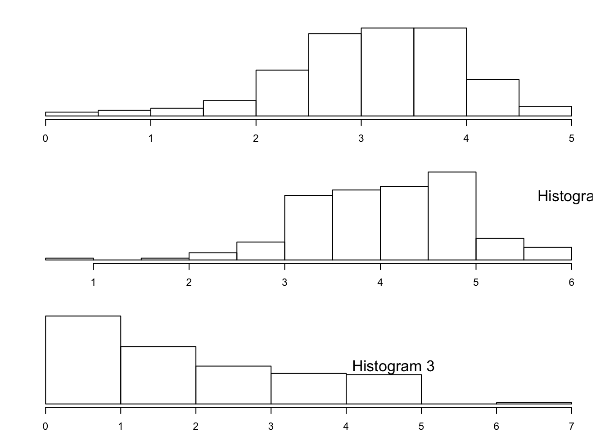
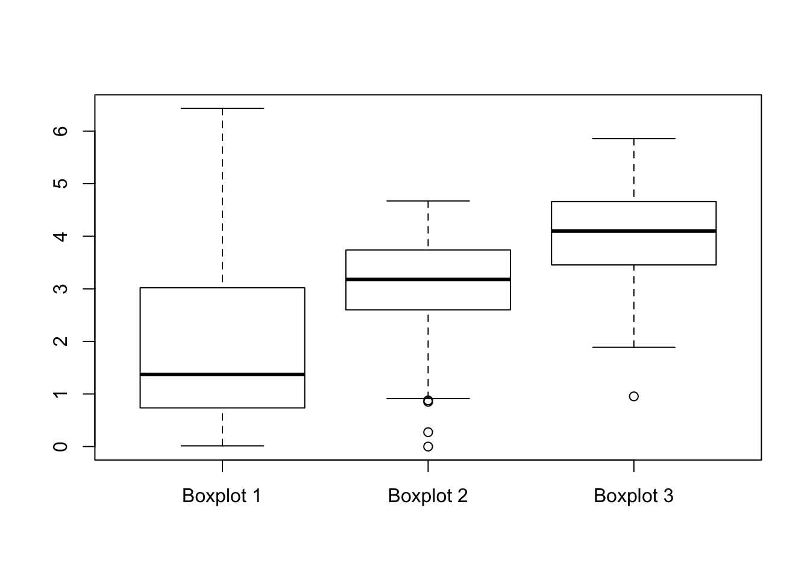

```{r setup, include=FALSE}
knitr::opts_chunk$set(echo = TRUE)
```

# Lab 2

## Link for textbook

https://r4ds.hadley.nz/

## Library Imports
```{r}
library(nycflights13)
library(tidyverse)
library(ggplot2)
```

## (1) Section 3.2.5 Questions 

Getting an initial look at the data:
```{r}
head(flights, 25)
```

### 1. In a single pipeline for each condition, find all flights that meet the condition:
  
  - Had an arrival delay of two or more hours
```{r}
flights|>
  filter(arr_delay >= 120)
```
  
  - Flew to Houston (IAH or HOU)
```{r}
flights|>
  filter(dest == "IAH" | dest == "HOU")
```
  
  - Were operated by United, American, or Delta
```{r}
flights|>
  filter(carrier == "UA" | carrier == "AA" | carrier == "DL")
```

  - Departed in summer (July, August, and September)
```{r}
flights|>
  filter(month == 7 | month == 8 | month == 9)
```

  - Arrived more than two hours late but didn’t leave late
```{r}
flights|>
  filter(arr_delay >= 120 & dep_delay <= 0)
```

  - Were delayed by at least an hour, but made up over 30 minutes in flight
```{r}
flights|>
  filter(dep_delay >= 60 & arr_delay <= dep_delay-30)
```

### 2. Sort flights to find the flights with the longest departure delays. Find the flights that left earliest in the morning.
```{r}
#Longest departure delays
longest_dep_delay_df <- flights |>
  arrange(desc(dep_delay))
head(longest_dep_delay_df, 10)
```
```{r}
#Earliest in the morning
earliest <- flights |>
  arrange(dep_time)
head(earliest, 10)
```
### 3. Sort flights to find the fastest flights. (Hint: Try including a math calculation inside of your function.)

```{r}
#Arrange the flights by the arrival time minus the departure time.
fastest <- flights |>
  arrange(arr_time-dep_time)
head(fastest, 10)
```

- This seems like it could produce an incorrect result, unless R handles math functions on HHMM time formats implicitly. For example, an arrival time of 54 minus a departure time of 2400 would be -2346 if R just calls a subtraction on the integer, which may not be the fastest flight. The code block, below, verifies the output of the subtraction of dep_time from arr_time:

Source for understanding lists in R:
https://stackoverflow.com/questions/2050790/how-to-correctly-use-lists

Source for appending to lists in R:
https://stackoverflow.com/questions/26508519/how-to-add-elements-to-a-list-in-r-loop

Newline print source:
https://www.geeksforgeeks.org/r-program-to-print-a-new-line-in-string/

Source for defining functions:
https://www.w3schools.com/r/r_functions.asp

String splitting resource: 
https://builtin.com/articles/strsplit

String length source:
https://stackoverflow.com/questions/11134812/how-to-find-the-length-of-a-string-in-r

Converting departure time to string source:
https://www.geeksforgeeks.org/convert-an-object-to-a-string-in-r-programming-tostring-function/

Source for adding list as column: https://www.geeksforgeeks.org/insert-list-as-dataframe-column-in-r/

Source for creating a date sequence: https://stackoverflow.com/questions/25677035/how-to-create-a-range-of-dates-in-r


```{r}
# Note: I left the entire walk through of the process in this code block. 
# This is in no way optimized, I just wanted to keep track of the process to come
# to my conclusion. Also, I am sure I made this far more complicated than I needed
# to, and I am willing to bet I misunderstood the question or there is a nice, clean
# function in the R standard library that does all of this for me. But, this was 
# a fun exercise and I learned a lot doing it. 

# Remove NA's and NULL's
non_na_flights <- flights |>
  filter(!is.na(dep_time) & !is.na(arr_time) & !is.null(dep_time) & !is.null(arr_time))

# Sort the departure time by descending
desc_dep_time <- non_na_flights |> 
  arrange(desc(dep_time))

# Get the number of rows in desc_dep_time
#print(nrow(desc_dep_time))

# Loop through the data frame and perform the subtraction. 
# Append the subtracted items to a new list
# Also, append the raw data to it's own list to verify the subtraction
flight_time <- list()
data <- list()
for (i in 1:nrow(desc_dep_time)) {
  flight_time[[i]] <- desc_dep_time$arr_time[i] - desc_dep_time$dep_time[i]
  data[[i]] <- c(desc_dep_time$arr_time[i],desc_dep_time$dep_time[i])
}

# The for loop, below, was used for debugging an error when correcting the flight
# time, below.
# for (i in which(is.na(flight_time))) {
#   print(paste(desc_dep_time$arr_time[i], desc_dep_time$dep_time[i],flight_time[[i]]))
# }

# Verify the output
print("Original data,  Calculated Flight Time")
paste(data[c(1:100)], flight_time[c(1:100)])

cat("\n\n")

# Correct the negative flight times. This can be done by adding the departure
# time to the result
corrected_flight_time <- list()
for (i in 1:nrow(desc_dep_time)) {
   if (flight_time[[i]] <= 0 & !is.na(flight_time[[i]])) {
     corrected_flight_time[[i]] <- (2400 - desc_dep_time$dep_time[i]) + (desc_dep_time$dep_time[i] + flight_time[[i]])
     #print(paste(i,corrected_flight_time[[i]]))
   } else if (!is.na(flight_time[[i]])) {
     corrected_flight_time[[i]] <- flight_time[[i]]
   }
}

paste(corrected_flight_time[c(1:50)])

# Based on index 50 of the result, it is clear the math is incorrect because of 
# the departure and arrival time formats (this should be 60, not 100). 
# Time to fix it...
```

```{r}
convert_time_to_minutes <- function(input_time) {
  # String splitting depends on the length of the string
  # Split the departure time string and store it as a total 
  if (nchar(input_time) == 4){
    # Split the string:
    hour <- as.integer(paste0(unlist(strsplit(input_time, split = ""))[1:2], collapse = ""))
    minute <- as.integer(paste0(unlist(strsplit(input_time, split = ""))[3:4], collapse = ""))
  } else if (nchar(input_time) == 3) {
    # Split after the first character
    hour <- as.integer(paste0(unlist(strsplit(input_time, split = ""))[1], collapse = ""))
    minute <- as.integer(paste0(unlist(strsplit(input_time, split = ""))[2:3], collapse = ""))
  } else if (nchar(input_time) <= 2) {
    hour <- 0
    minute <- as.integer(input_time)
  }
  
  return (hour * 60 + minute)
}

# Correct the format of the arrival and departure times and store as the total
# number of minutes in the day
flight_time_in_minutes_list <- list()
flight_duration <- list()

for (i in 1:nrow(desc_dep_time)) {
  # Convert the departure time to a string:
  dep_time_minutes <- convert_time_to_minutes(toString(desc_dep_time$dep_time[i]))
  arr_time_minutes <- convert_time_to_minutes(toString(desc_dep_time$arr_time[i]))
  
  # Compute the flight duration
  flight_duration[[i]] <- arr_time_minutes - dep_time_minutes
  
  # correct the negative flight durations
  if (flight_duration[[i]] < 0){
    flight_time_in_minutes_list[[i]] <- ((60*24) - dep_time_minutes) + arr_time_minutes
  } else {
    flight_time_in_minutes_list[[i]] <- flight_duration[[i]]
  }
  
}
print("Corrected negative flight times in minutes:")
paste(flight_time_in_minutes_list[c(1:100)])
cat("\n\n")

# Based on the output above, the math is now correct for negative flight times.

# Check the output for non-negative flight times
print("Corrected non-negative flight times in minutes:")
paste(head(data[c(which(flight_duration > 0))],50), head(flight_time_in_minutes_list[c(which(flight_duration > 0))],50))
cat("\n\n")

# This now seems to be outputting the data correctly... time to sort the original 
# data set by the indices of corrected flight duration
```
```{r}
# The easiest way to go about this is to add the list as a column to the data 
# frame, then call the arrange() function on the column.

desc_dep_time <- add_column(desc_dep_time, flight_duration = unlist(flight_time_in_minutes_list))
head(desc_dep_time, 100)
```

```{r}
# Now sort desc_dep_time by flight duration
desc_dep_time <- desc_dep_time|>
  arrange(flight_duration)
head(desc_dep_time, 100)
tail(desc_dep_time, 100)
```
After all of that, I took another look at the book and realized I could have stepped through most of the process with the *mutate()* function... :(


### 4. Was there a flight on every day of 2013?
```{r}
# First, filter by year, add a YYYY-MM-DD column, and get distinct dates
filtered_by_year <- flights |>
  filter(year == 2013) |>
  mutate(date = as.Date(paste(year, month, day, sep="-"))) |>
  distinct(date)

# Generate the date range
dates <- seq(as.Date("2013-01-01"), by = "day", length.out = 365)

# Loop through filtered dates and see if any were missed
no_fly_count <- 0
fly_count <- 0
for (i in dates){
  if (length(which(filtered_by_year$date==i)) == 0){
    paste("There were zero flights on ",filtered_by_year)
    no_fly_count <- no_fly_count + 1
  } else {
    fly_count <- fly_count + 1
  }
}
cat("Days with flights: ", fly_count, "\tDays without flights: ", no_fly_count)
```
- There was a flight on every day in 2013.

### 5. Which flights traveled the farthest distance? Which traveled the least distance?
```{r}
flight_distance <- flights |>
  arrange(distance) |>
  distinct(flight)


shortest <- head(flight_distance, 10)
longest <- tail(flight_distance, 10)

new_df <- as.data.frame(shortest$flight, longest$flight)
new_df

cat("Farthest Flights:\tShortest Flights:\n")

for (i in 1:10) {
  cat(longest$flight[[i]],"\t\t\t",shortest$flight[[i]],"\n")
}
```

### 6. Does it matter what order you used filter() and arrange() if you’re using both? Why/why not? Think about the results and how much work the functions would have to do.

- Yes, it does matter (mostly for large datasets). The filter function will remove rows from the data frame based on a condition (meaning it has to *search* for the condition among all rows), where arrange sorts based on a criteria. Based on my existing knowledge of computer science and some additional information from [this blog](https://www.quora.com/Is-sorting-faster-than-searching), searches can be performed more efficiently on a sorted data set, especially when the number of search targets are unknown. 


## (1) Section 3.3.5 Questions

### 1. Compare dep_time, sched_dep_time, and dep_delay. How would you expect those three numbers to be related?
```{r}
head(flights,10)
```
- I would expect the relationship to be: dep_delay = dep_time - sched_dep_time

### 2. Brainstorm as many ways as possible to select dep_time, dep_delay, arr_time, and arr_delay from flights.

```{r}
flights

selected1 <- flights |>
  select(dep_time, dep_delay, arr_time, arr_delay)
selected1

selected2 <- flights |>
  select(starts_with("arr"), starts_with("dep"))
selected2

char_vec <- c("dep_time", "dep_delay", "arr_time", "arr_delay")

selected3 <- flights |>
  select(all_of(char_vec))
selected3

selected4 <- flights |>
  select(any_of(char_vec))
selected4

selected5 <- flights |>
  select(!year:day, !sched_dep_time, !sched_arr_time, !carrier:time_hour)
```


### 3. What happens if you specify the name of the same variable multiple times in a select() call?
```{r}
selected <- flights |>
  select(dep_time, dep_time, dep_time, dep_time)
selected
```
- It seems like R internally removes duplicate variable specifications.

### 4. What does the any_of() function do? Why might it be helpful in conjunction with this vector?

> variables <- c("year", "month", "day", "dep_delay", "arr_delay")

- Any of will select all variables in the data frame from the list, ignoring names that don't exist. This is helpful for large datasets because the vector could be generated programatically.

### 5. Does the result of running the following code surprise you? How do the select helpers deal with upper and lower case by default? How can you change that default?

> flights |> select(contains("TIME"))

```{r}
flights |> select(contains("TIME"))
```
- This seems like a reasonable result, many programming languages have case handling built in. For R, there is an "ignore.case" parameter in the "contains" function that is defaulted to TRUE. This can be disabled by passing it with the function, as seen below:
```{r}
flights |> select(contains("TIME", ignore.case = FALSE))
```
-As expected, this returned an empty tibble, because all variables in this dataset that contain "time" are lowercase.

### 6. Rename air_time to air_time_min to indicate units of measurement and move it to the beginning of the data frame.

```{r}
renamed <- flights |>
  rename(air_time_min = air_time ) |>
  relocate(air_time_min)
renamed
```

### 7. Why doesn’t the following work, and what does the error mean?

>flights |> 
  select(tailnum) |> 
  arrange(arr_delay)

- This does not work because tailnum is the only selected column. The data frame cannot be arranged by the arr_delay variable because it does not exist in the selected set. The error indicates the arr_delay object in the flights data frame cannot be found.

## (1) Section 3.3.5 Questions

### 1. Which carrier has the worst average delays? Challenge: can you disentangle the effects of bad airports vs. bad carriers? Why/why not? (Hint: think about flights |> group_by(carrier, dest) |> summarize(n()))
```{r}
carriers <- flights |>
  group_by(carrier) |>
  summarize(
    avg_dep_delay = mean(dep_delay, na.rm = TRUE),
    avg_arr_delay = mean(arr_delay, na.rm = TRUE)
  ) |>
  mutate(sum_of_avg_delay = avg_dep_delay + avg_arr_delay) |>
  arrange(sum_of_avg_delay)

tail(carriers,3)
```
- The worst average delays come from EV, FL, and F9 carriers.

**Challenge**

```{r}
# As a means to better understand the group_by function, first group by each 
# of the variables independently
challenge1 <- flights |>
  group_by(carrier) |>
  summarize(
    avg_dep_delay = mean(dep_delay, na.rm = TRUE),
    avg_arr_delay = mean(arr_delay, na.rm = TRUE), 
  )|>
  mutate(sum_of_avg_delay = avg_dep_delay + avg_arr_delay) |>
  arrange(desc(sum_of_avg_delay))
challenge1

challenge2 <- flights |>
  group_by(origin) |>
  summarize(
    avg_dep_delay = mean(dep_delay, na.rm = TRUE),
    avg_arr_delay = mean(arr_delay, na.rm = TRUE), 
  )|>
  mutate(sum_of_avg_delay = avg_dep_delay + avg_arr_delay) |>
  arrange(desc(sum_of_avg_delay))
challenge2

challenge3 <- flights |>
  group_by(dest) |>
  summarize(
    avg_dep_delay = mean(dep_delay, na.rm = TRUE),
    avg_arr_delay = mean(arr_delay, na.rm = TRUE), 
  )|>
  mutate(sum_of_avg_delay = avg_dep_delay + avg_arr_delay) |>
  arrange(desc(sum_of_avg_delay))
challenge3

```
- Based on the output, the worst carriers are F9, FL, and EV, the worst origin
airports are EWR, JFK, and LGA, and the worst destination airports are CAE,
TUL, and OKC. Now, try grouping by all three variables simultaneously...

```{r}
challenge <- flights |>
  group_by(carrier, origin, dest) |>
  summarize(
    avg_dep_delay = mean(dep_delay, na.rm = TRUE),
    avg_arr_delay = mean(arr_delay, na.rm = TRUE), 
  )|>
  mutate(sum_of_avg_delay = avg_dep_delay + avg_arr_delay) |>
  arrange(desc(sum_of_avg_delay))
challenge
```
- It appears that EV flies out of LGA and JFK very often in the grouped list. This is a good indication that the EV carrier may not be the issue, but the origin airports skew the delays positive.

### 2. Find the flights that are most delayed upon departure from each destination.

```{r}
flight_delays <- flights |>
  group_by(flight, dest) |>
  summarize(
    avg_dep_delay = mean(dep_delay, na.rm = TRUE)
  ) |>
 arrange(desc(avg_dep_delay))
flight_delays
```

### 3. How do delays vary over the course of the day? Illustrate your answer with a plot.

Source for extracting the time from POSIXct data type:
https://stackoverflow.com/questions/9839343/extracting-time-from-posixct

```{r}

# Create a function to take in a year, day, and month and return a filtered, 
# summarized dataframe
grouped_data <- function() {
  temp_df <- flights |>
    # Extracting the time from POSIXct data type
    mutate(
      parsed_time = strftime(time_hour, format="%H:%M:%S")
      ) |>
    # Group by time_hour, as this can be create the x axis over the course
    # of the day
    group_by(parsed_time) |>
    # Remove all NA values
    filter(!is.na(arr_delay) & !is.na(dep_delay)) |>
    # Then summarize the average arrival and departure delays across each timestamp
    summarize(
      avg_arr_delay = mean(arr_delay, na.rm=TRUE),
      avg_dep_delay = mean(dep_delay, na.rm=TRUE)
    )

  return (temp_df)
}

# Let the function, above, process the data for the sake of making this neat
df <- grouped_data()
df

# plot a line graph over the course of the day for arrival and departure delays
ggplot(
  data = df,
  mapping = aes(x=parsed_time, y=avg_arr_delay)
) + geom_point()

ggplot(
  data = df,
  mapping = aes(x=parsed_time, y=avg_dep_delay)
) + geom_point()


```
- The average delay for a given time increases over the course of the day, with the sharpest spike in delays occurring between 12:00 and 18:00.

### 4. What happens if you supply a negative n to slice_min() and friends?
```{r}
# Test each slice function with n=1
flights |> slice_head(n = 1)
flights |> slice_tail(n = 1) 
flights |> slice_min(arr_delay, n = 1) 
flights |> slice_max(arr_delay, n = 1) 
flights |> slice_sample(n = 1)

# Test each slice function with n=-1
flights |> slice_head(n = -1)
flights |> slice_tail(n = -1) 
flights |> slice_min(arr_delay, n = -1) 
flights |> slice_max(arr_delay, n = -1) 
flights |> slice_sample(n = -1)
```
- The functions perform as follows with a negative input:
  a. slice_head returns every row except the last
  b. slice_tail returns every row except the first
  c. slice_min sorts from minimum to maximum
  d. slice_max sorts from maximum to minimum
  e. slice_sample returns the dataframe minus the randomly sliced sample

### 5. Explain what count() does in terms of the dplyr verbs you just learned. What does the sort argument to count() do?
```{r}
understanding_count <- flights |>
  group_by(time_hour) |>
  count(time_hour)
understanding_count

understanding_count <- flights |>
  summarize(
    max_time_hour = max(time_hour)
    ) |>
  count(max_time_hour)
understanding_count

understanding_count <- flights |>
  count(time_hour) |>
  summarize(
    avg_n = mean(n)
    )
understanding_count
```
- Count returns the number of instances of a given variable in the modified data frame. It functions similarly to group_by, but it also returns the instances as a new row. The last *understanding_count* data frame first counts time_hour, then finds the average number of instances across all times. 

### 6. Suppose we have the following tiny data frame:

```{r}
df <- tibble(
  x = 1:5,
  y = c("a", "b", "a", "a", "b"),
  z = c("K", "K", "L", "L", "K")
)

```

#### a. Write down what you think the output will look like, then check if you were correct, and describe what group_by() does.

```{r}
df |>
  group_by(y)
```
  
EXPECTED OUTPUT: 

|  x  |  y  |  z  |
|:---:|:---:|:---:|
|  1  |  a  |  K  |
|  2  |  b  |  K  |
|  3  |  a  |  L  |
|  4  |  a  |  L  |
|  5  |  b  |  K  |
  
```{r}
df1 <- df |> 
  group_by(y)
df1
```
    group_by does not modify the tibble, it just creates groups based on the unique values in the grouped column. 

#### b. Write down what you think the output will look like, then check if you were correct, and describe what arrange() does. Also, comment on how it’s different from the group_by() in part (a).

```{r}
df |>
  arrange(y)
```

EXPECTED OUTPUT: 

|  x  |  y  |  z  |
|:---:|:---:|:---:|
|  1  |  a  |  K  |
|  3  |  a  |  L  |
|  4  |  a  |  L  |
|  2  |  b  |  K  |
|  5  |  b  |  K  |

```{r}
df2 <- df |>
  arrange(y)
df2
```
    arrange sorts the input column in ascending order, which, unlike group_by, actively modifies the row order in the data frame. I made a guess about the implementation of arrange, assuming that it would loop row-wise until it found a non *a* value, store the index, then continue until an *a* was found and flip the rows by index. It seems that was the case based on the resulting row order.

#### c. Write down what you think the output will look like, then check if you were correct, and describe what the pipeline does.

```{r}
df |>
  group_by(y) |>
  summarize(mean_x = mean(x))
```
  
EXPECTED OUTPUT: 

|  y  |  mean_x  |
|:---:|:---:|
|  a  |  2.67 |
|  b  |  3.5  |

```{r}
df3 <- df |>
  group_by(y) |>
  summarize(mean_x = mean(x))
df3
```
    Summarizing on a variable will collapse the output to the grouped range. In this case, x is averaged on each of the y groups, therefore the calculation is: mean_x(a) = (1+3+4)/3 = 2.667 and mean_x(b) = (2+5)/2 = 3.5. The pipeline feeds the output of the df.group_by(y) function into the summarize function. Programmatically, this would look like summarize(df.group_by(y), mean_x = mean(x)). The pipeline recursively wraps the output of the prior function into the next function in the pipeline.

#### d. Write down what you think the output will look like, then check if you were correct, and describe what the pipeline does. Then, comment on what the message says.

```{r}
df |>
  group_by(y, z) |>
  summarize(mean_x = mean(x))
```
  
EXPECTED OUTPUT: 

|  y  |  z  |  mean_x  |
|:---:|:---:|:---:|
|  a  |  K  |  1.0  |
|  a  |  L  |  3.5  |
|  b  |  k  |  3.5  |

```{r}
df4 <- df |>
  group_by(y, z) |>
  summarize(mean_x = mean(x))
df4
```
    - The pipeline groups the input dataframe by y values, then z values. The y group has two instances of *a* because there are both (a,K) and (a,L) pairs of (y,z) groups for y=a, whereas there are only (b, K) pairs of y=b groups for (y,z). The mean function behaves as follows for each group: mean((y,z)_(a,K)) = 1/1 = 1, mean((y,z)_(a,L)) = (3+4)/2 = 3.5, mean((y,z)_(b,K)) = (2+5)/2 = 3.5. The message is in regard to the implementation of the summarize(group_by(var1,var2,var3,etc.)) function. By default, this function drops the last group, but this can be mitigated using the .group argument.

#### e. Write down what you think the output will look like, then check if you were correct, and describe what the pipeline does. How is the output different from the one in part (d)?

```{r}
df |>
  group_by(y, z) |>
  summarize(mean_x = mean(x), .groups = "drop")
```

EXPECTED OUTPUT: 

|  y  |  z  |  mean_x  |
|:---:|:---:|:---:|
|  a  |  K  |  1.0  |
|  a  |  L  |  3.5  |
|  b  |  k  |  3.5  |

```{r}
df5 <- df |>
  group_by(y, z) |>
  summarize(mean_x = mean(x), .groups = "drop")
df5
```

    The pipeline, in this case, does the exact same set of operations as the last question. The .groups = "drop" argument drops the groups, leaving just the resulting tibble in the output, not a tibble with a set of three groups ((a,K),(a,L),(b,K)).

#### f. Write down what you think the outputs will look like, then check if you were correct, and describe what each pipeline does. How are the outputs of the two pipelines different?

```{r}
df |>
  group_by(y, z) |>
  summarize(mean_x = mean(x))
```

EXPECTED OUTPUT: 

|  y  |  z  |  mean_x  |
|:---:|:---:|:---:|
|  a  |  K  |  1.0  |
|  a  |  L  |  3.5  |
|  b  |  k  |  3.5  |

```{r}
df6 <- df |>
  group_by(y, z) |>
  summarize(mean_x = mean(x))
df6
```

    This pipeline does the same process as the pipeline in the prior question, but it retains the grouped dataframe.


```{r}
df |>
  group_by(y, z) |>
  mutate(mean_x = mean(x))
```
  
EXPECTED OUTPUT: 

|  x  |  y  |  z  |  mean_x  |
|:---:|:---:|:---:|:---:|
|  1  |  a  |  K  |  1.0  |
|  2  |  b  |  K  |  3.5  |
|  3  |  a  |  L  |  3.5  |
|  4  |  a  |  L  |  3.5  |
|  5  |  b  |  K  |  3.5  |
  
```{r}
df7 <- df |>
  group_by(y, z) |>
  mutate(mean_x = mean(x))
df7
```
    This pipeline does not compress the output into a 3x3 tibble like the prior pipeline. Instead, the entire data frame is retained, as well as the y and z groups, and additionally the calculated mean column is added for each row. The grouped outputs remain the same, and they are distributed across the remaining rows of the tibble. In the summarized tibbles, these rows are removed from the data frame as they are nested into the (y,z) group. This is the key difference from the previous pipeline.

## (2) Exercise 3.1 from Yakir

Three sequences of data were saved in 3 R objects named “x1”, “x2” and “x3”, respectively. The application of the function “summary” to each of these objects is presented below:

> summary(x1)
   Min. 1st Qu.  Median    Mean 3rd Qu.    Max.
  0.000   2.498   3.218   3.081   3.840   4.871
  
> summary(x2)
     Min.   1st Qu.    Median      Mean   3rd Qu.      Max.
0.0001083 0.5772000 1.5070000 1.8420000 2.9050000 4.9880000

> summary(x3)
   Min. 1st Qu.  Median    Mean 3rd Qu.    Max.
  2.200   3.391   4.020   4.077   4.690   6.414
  
In Figure 3.3 one may find the histograms of these three data sequences, given in a random order. In Figure 3.4 one may find the box plots of the same data, given in yet a different order.

### 1. Match the summary result with the appropriate histogram and the appropriate box plot.

| Dataset | Histogram | Boxplot |
|:---:|:---:|:---:|
| x1 | 1 | 2 |
| x2 | 2 | 3 |
| x3 | 3 | 1 |

### 2. Is the value 0.000 in the sequence “x1” an outlier?

  - Yes, 0.000 in x1 appears to be an outlier as it is on the lower bound of the normal distribution and there is only a single data point for that value. Also, in the accompanying Boxplot 2, the point 0 is indicated on the plot as an open circle, identifying it as an outlier.

### 3. Is the value 6.414 in the sequence “x3” an outlier?

  - No, this is not an outlier, although it appear to be on the upper end of the expected range. This value is within the variance, identified by the box plot.


FIGURE 3.3: Three Histograms


FIGURE 3.4: Three Box Plots

## (3) Load the carprice, csv dataset into R, and use dplyr and ggplot to:

  - Load carprice dataset: 
  
```{r}
library(readr)
```
```{r}
carprice <- read_csv("carprice.csv")
```
### a. Use the basic df commands to find out what the variables in this data are, and how many rows and columns there are
      
```{r}
variable.names(carprice)
nrow(carprice)
ncol(carprice)
```
### b. Show a histogram of mpg.highway and Price, compute mean, median, standard deviation, skew and kurtosis for these variables, explain how differences in these values relate to visual differences in the histograms

```{r}
ggplot(
  data = carprice,
  mapping = aes(x = MPG.highway)
) +
  geom_histogram()

ggplot(
  data = carprice,
  mapping = aes(x = Price)
) +
  geom_histogram()
```

Skew and kurtosis calculation sources: 
https://www.geeksforgeeks.org/skewness-and-kurtosis-in-r-programming/
https://www.sciencedirect.com/topics/mathematics/kurtosis

Source to understand kurtosis:
https://ecampusontario.pressbooks.pub/econ/chapter/4-2-kurtosis/#:~:text=Kurtosis%20is%203%20for%20the,E%20K%20=%20K%20%E2%88%92%203%20.

```{r}
n <- length(carprice$MPG.highway)
computed_mpg_hwy <- carprice |>
  select(MPG.highway) |>
  summarize(
    computed_mean = mean(MPG.highway),
    computed_median = median(MPG.highway),
    computed_std_dev = sd(MPG.highway),
    computed_skew = (n * sum((MPG.highway - computed_mean)^3)) / ((n - 1) * (n - 2) * computed_std_dev^3),
    computed_kurtosis = (n * sum((MPG.highway - computed_mean)^4)) / ((n - 1) * (n - 2) * computed_std_dev^4)
  )
computed_mpg_hwy
```
```{r}
n <- length(carprice$Price)
computed_price <- carprice |>
  select(Price) |>
  summarize(
    computed_mean = mean(Price),
    computed_median = median(Price),
    computed_std_dev = sd(Price),
    computed_skew = (n * sum((Price - computed_mean)^3)) / ((n - 1) * (n - 2) * computed_std_dev^3),
    computed_kurtosis = (n * sum((Price - computed_mean)^4)) / ((n - 1) * (n - 2) * computed_std_dev^4)
  )
computed_price
```
Verification of my math using the moments package:
```{r}
library(moments)
```
```{r}
skew_mpg <- skewness(carprice$MPG.highway) 
kurtosis_mpg <- kurtosis(carprice$MPG.highway)
cat("MPG Highway Skew\t", skew_mpg, "\tMPG Highway Kurtosis\t", kurtosis_mpg, "\n")
skew_price <- skewness(carprice$Price) 
kurtosis_price <- kurtosis(carprice$Price)
cat("MPG Price Skew\t\t", skew_price, "\tMPG Price Kurtosis\t", kurtosis_price)
```
There is a slight difference between my output and the output from the moments package. I suspect this may be a result of the summarization. I'll try setting up the pipeline with the moments package functions to see if that corrects the issue. 

```{r}
n <- length(carprice$MPG.highway)
computed_mpg_hwy <- carprice |>
  select(MPG.highway) |>
  summarize(
    computed_mean = mean(MPG.highway),
    computed_median = median(MPG.highway),
    computed_std_dev = sd(MPG.highway),
    computed_skew = skewness(MPG.highway),
    computed_kurtosis = kurtosis(MPG.highway)
  )
computed_mpg_hwy
```
```{r}
n <- length(carprice$Price)
computed_price <- carprice |>
  select(Price) |>
  summarize(
    computed_mean = mean(Price),
    computed_median = median(Price),
    computed_std_dev = sd(Price),
    computed_skew = skewness(Price),
    computed_kurtosis = kurtosis(Price)
  )
computed_price
```
Hmmmmm, still didn't fix it. I am going to blame this on rounding throughout the pipeline steps 🙃. Anywho, onto the rest of the question.

    Mean: The differences in mean between the two histograms affects where the "center" of the distribution falls on the x-axis. A higher mean, like that of the MPG.highway column, would place the center of the normal distribution at a higher x value.
    
    Median: The median's relationship to the mean, i.e. how close the two values are, gives a cursory indication of how widely distributed the data set is. For example, the MPG.highway mean and median are almost equivalent, and this dataset appear to be quite normal. For Price, the median is about 12% lower than the mean, which indicates there are some large values that are skewing the mean high, which is evident in the histogram. 
    
    Standard Deviation: Standard deviation describes the spread of the dataset relative to the mean. As expected, the Price standard deviation is higher than the MPG.highway standard deviation, as the MPG.highway dataset is more evenly distributed about the mean.
    
    Skewness: Skewness is a measure of the tail length/thickness relative to the mean. A positive skew indicates a tail to the right of the normal distribution, which is prominently seen in the Price dataset (skewness=1.19). The MPG.highway dataset also has a positive skew, but it is closer to 0, which would be a symmetrical distribution. 
    
    Kurtosis: Kurtosis describes how "peakey" the distribution is. Perfectly normal distributions have a kurtosis of K=3. Excess kurtosis (EK) is defined as EK = K-3, which can be used to quickly identify the shape of the distribution. Positive EK is a narrower distribution, EK = 0 is a perfect normal distribution, and negative EK is a wide distribution. Based on the EK values of MPG.highway and Price, 1.19 and 0.84, respectively, both datasets are narrower than normal, MPG.highway more than Price. 
    
### c. Create a boxplot that shows Price (not min or max price) as a function of Type (make sure Type is set to be a factor and use ggplot)
  
```{r}
type_factor <- as.factor(carprice$Type)
ggplot(
  data = carprice,
  mapping = aes(x=type_factor, y=carprice$Price, color = type_factor)
) + geom_boxplot()
```
### d. Create a violin plot that shows RoughRange of all cars. Add the dot plot on top of it
  
Source for dotplot: 
https://www.sthda.com/english/wiki/ggplot2-dot-plot-quick-start-guide-r-software-and-data-visualization

```{r}
type_factor <- as.factor(carprice$Type)
ggplot(
  data = carprice,
  mapping = aes(x=type_factor, y=carprice$RoughRange, color = type_factor)
) + geom_violin() + geom_dotplot(binaxis='y', stackdir='center')
```
### e. Create a table that shows the mean Price, mean MPG.Highway and mean Rough.range by car type
  
```{r}
table <- carprice |>
  group_by(Type) |>
  summarize(
    mean_price = mean(Price),
    mean_MPG_highway = mean(MPG.highway),
    mean_rough_range = mean(RoughRange)
  )
table
```
### f. Plot a bi-plot (x-y graph) of Price vs MPG.highway for all cars that are listed as "small" or "sporty"
  
Bi-plot Source: 
https://www.geeksforgeeks.org/how-to-create-a-biplot-in-r/#

```{r}
# Filter by type
type_filtered <- carprice |>
  mutate(type_as_factor = as.factor(Type)) |>
  filter(type_as_factor == "Small" | type_as_factor == "Sporty") |>
  select(Price, MPG.highway)

type_filtered_pca_result <- prcomp(type_filtered)
type_filtered_pca_result

# Create bi-plot
biplot(type_filtered_pca_result)
```
### g. Plot a bi-plot of Price vs MPG.highway, color coding by Type
```{r}
library(ggfortify)
```
```{r}
# Filter by type
pca_analysis <- carprice |>
  mutate(type_as_factor = as.factor(Type)) |>
  filter(type_as_factor == "Small" | type_as_factor == "Sporty") |>
  select(Price, MPG.highway)

pca_result <- prcomp(pca_analysis)
pca_result

type_filtered <- carprice |>
  mutate(type_as_factor = as.factor(Type)) |>
  filter(type_as_factor == "Small" | type_as_factor == "Sporty") |>
  select(type_as_factor, Price, MPG.highway)

# Create a biplot using ggplot2 and ggfortify
autoplot(pca_result, data = type_filtered, colour = 'type_as_factor',
         loadings = TRUE, loadings.label = TRUE, loadings.label.size = 3)
```  
  
  
  
  
  
  
  
