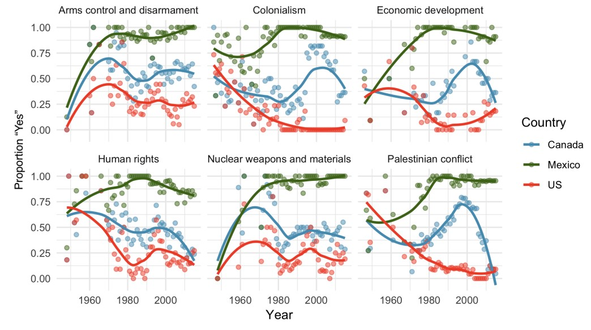
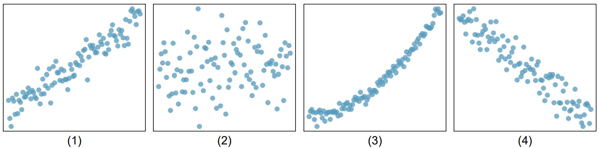
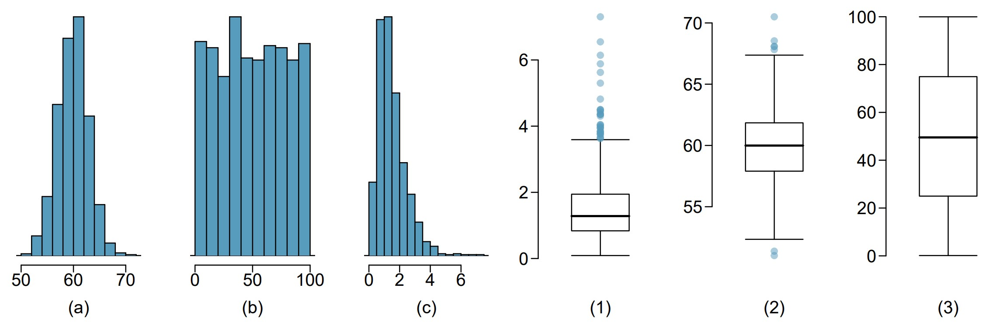
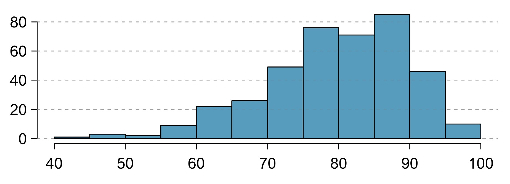
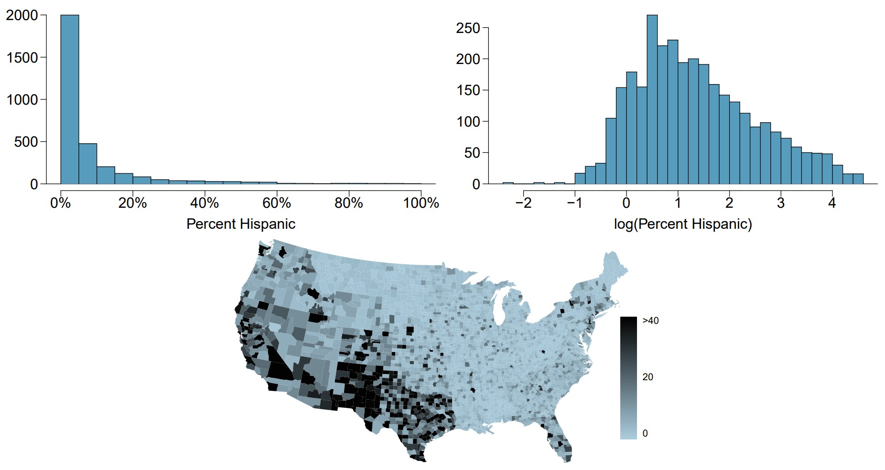
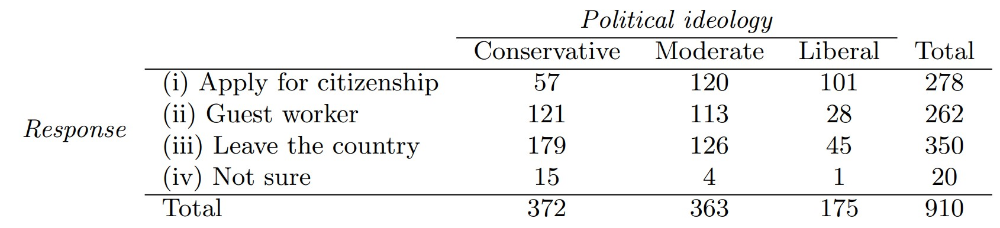
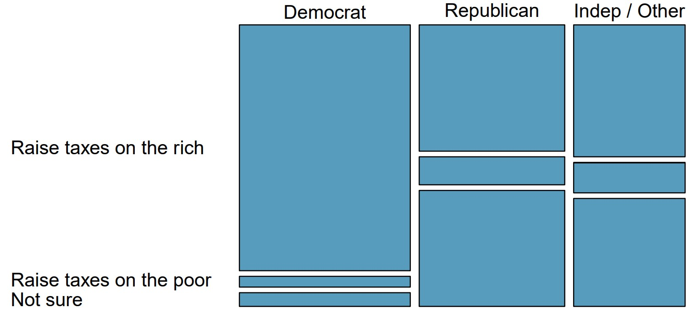

```{r setup, include=FALSE}
knitr::opts_chunk$set(echo = TRUE)
```

# LAB 3

Imports:
```{r}
library(tidyverse)
library(ggplot2)
library(dplyr)
```

## 1.4 Buteyko method, study components
>The Buteyko method is a shallow breathing technique developed by Konstantin Buteyko, a Russian doctor, in 1952. Anecdotal evidence suggests that the Buteyko method can reduce asthma symptoms and improve quality of life. In a scientific study to determine the effectiveness of this method, researchers recruited 600 asthma patients aged 18-69 who relied on medication for asthma treatment. These patients were randomly split into two research groups: one practiced the
Buteyko method and the other did not. Patients were scored on quality of life, activity, asthma symptoms, and medication reduction on a scale from 0 to 10. On average, the participants in the Buteyko group experienced a significant reduction in asthma symptoms and an improvement in quality of life.

### (a) Identify the main research question of the study.
*The main research question is whether the Buteyko method is an effective way to reduce asthma symptoms.*

### (b) Who are the subjects in this study, and how many are included?
*The subjects of the study are asthma patients, aged 18-69, all of which relying on asthma medication. There are 600 patients total.*

### (c) What are the variables in the study? Identify each variable as numerical or categorical. If numerical, state whether the variable is discrete or continuous. If categorical, state whether the variable is ordinal.
*The variables are: Patient, Age, Buteyko, Quality of Life, Activity, Asthma Symptoms, and Medication Reduction. In this case, I think these variables could be either categorical or numerical, depending on how the data is structured. Imagine the two possible tables, below:*

**Table 1**

|Patient|Age|Buteyko|Category|Score|
|:--:|:--:|:--:|:--:|:--:|
|1|43|NO|Quality of Life|7|
|1|43|NO|Activity|3|
|1|43|NO|Asthma Symptoms|6|
|1|43|NO|Medication Reduction|8|
|2|18|YES|Quality of Life|6|
|2|18|YES|Activity|8|
|2|18|YES|Asthma Symptoms|8|
|2|18|YES|Medication Reduction|9|

**Table 2**

|Patient|Age|Buteyko|Quality of Life|Activity|Asthma Symptoms|Medication Reduction|
|:--:|:--:|:--:|:--:|:--:|:--:|:--:|
|1|43|NO|7|3|6|8|
|2|18|YES|6|8|8|9|

*In Table 1, the variables are represented categorically. Table 2 contains the same data as Table 1, however, each of the variables are represented numerically. In the categorical case, I would assume the patient variable would be ordinal and the rest would be variable, but this is entirely dependent on how the data is represented by those who conducted the study. For the in the numeric case, all of the variables are discrete.*

## 1.6 Stealers, study components
>In a study of the relationship between socio-economic class and unethical behavior, 129 University of California undergraduates at Berkeley were asked to identify themselves as having low or high social-class by comparing themselves to others with the most (least) money, most (least) education, and most (least) respected jobs. They were also presented with a jar of individually wrapped candies and informed that the candies were for children in a nearby laboratory, but that they could take some if they wanted. After completing some unrelated tasks, participants reported the number of candies they had taken.

### (a) Identify the main research question of the study.

*The main research question is whether socio-economic class is correlated with unethical behavior.*

### (b) Who are the subjects in this study, and how many are included?

*The subjects are members of the UC Berkeley undergraduate class, of which there are 129.*

### (c) The study found that students who were identified as upper-class took more candy than others. How many variables were recorded for each subject in the study in order to conclude these findings? State the variables and their types.

*There were likely four variables per subject to come to this conclusion; money ranking (assuming a low, average, high scale), education ranking (assuming a low, average, high scale), job respect level (assuming a low, average, high scale), and number of candies taken. Each of the rankings are categorical, and the number of candies taken is numerical.*

## 1.12 UN Votes
>The visualization below shows voting patterns in the United States, Canada, and Mexico in the United Nations General Assembly on a variety of issues. Specifically, for a given year between 1946 and 2015, it displays the percentage of roll calls in which the country voted yes for each issue. This visualization was constructed based on a dataset where each observation is a country/year pair.



### (a) List the variables used in creating this visualization.

*The variables include country, year, issue type, proportion of "yes" votes.* 

### (b) Indicate whether each variable in the study is numerical or categorical. If numerical, identify as continuous or discrete. If categorical, indicate if the variable is ordinal.

*The numerical variables are year and the proportion of yes votes, which are discrete and continuous, respectively. The categorical variables are country and issue type, and the numerical variables are year and proportion that voted yes. It seems possible that either country or issue type could be ordinal. In either case, only one of the categorical variables can be ordinal, so the other would have to be variable.*


## 1.18 Cats on YouTube
>Suppose you want to estimate the percentage of videos on YouTube that are cat videos. It is impossible for you to watch all videos on YouTube so you use a random video picker to select 1000 videos for you. You find that 2% of these videos are cat videos. Determine which of the following is an observation, a variable, a sample statistic (value calculated based on the observed sample), or a population parameter.

### (a) Percentage of all videos on YouTube that are cat videos.

*Population parameter.*

### (b) 2%.

*Sample statistic*

### (c) A video in your sample.

*Observation*

### (d) Whether or not a video is a cat video.

*Variable*

## 1.20 Housing proposal across dorms
>On a large college campus first-year students and sophomores live in dorms located on the eastern part of the campus and juniors and seniors live in dorms located on the western part of the campus. Suppose you want to collect student opinions on a new housing structure the college administration is proposing and you want to make sure your survey equally represents opinions from students from all years.

### (a) What type of study is this?

*This is an observational study.*

### (b) Suggest a sampling strategy for carrying out this study

*A method for equal surveying would be to survey an equal number of students from both the east and west side(s) of the campus. Alternatively, if there is a common area in the campus, such as a dining hall, students can be sampled from there. Because the entire campus is dorm style housing, an even mix of students will likely be present at any given time.*

## 1.34 Exercise and mental health
>A researcher is interested in the effects of exercise on mental health and he proposes the following study: Use stratified random sampling to ensure representative proportions of 18-30, 31-40 and 41- 55 year olds from the population. Next, randomly assign half the subjects from each age group to exercise twice a week, and instruct the rest not to exercise. Conduct a mental health exam at the beginning and at the end of the study, and compare the results.

### (a) What type of study is this?

*This is an experiment.*

### (b) What are the treatment and control groups in this study?

*The treatment group is the exercise group, and the control group is the non-exercise group.*

### (c) Does this study make use of blocking? If so, what is the blocking variable?

*This study utilizes blocking for the age variable.*

### (d) Does this study make use of blinding?

*This study does not utilize blinding. Participants and the researchers are aware of whether each individual is in the control or treatment group.*

### (e) Comment on whether or not the results of the study can be used to establish a causal relationship between exercise and mental health, and indicate whether or not the conclusions can be generalized to the population at large.

*I think a causal relationship could be determined, but I believe it would be a weak one. There are several other variables that are not controlled or tested within this study, such as how often participants already exercise or whether there are known mental health issues within the participant group. That said, the random sample in the study would represent the general population well, so the results could be extrapolated to the overall population.*

### (f) Suppose you are given the task of determining if this proposed study should get funding. Would you have any reservations about the study proposal?

*As mentioned above, I think the study could be a little more tightly constrained to remove some other confounding variables.*

## 2.2 Associations. 
>Indicate which of the plots show:

### (a) a positive association 

*1,3*

### (b) a negative association 

*4*

### (c) no association.

*2*

### (d) Also determine if the positive and negative associations are linear or nonlinear. Each part may refer to more than one plot.

*1: Linear*
*3: Exponential*
*4: Linear*



## 2.6 Sleeping in college 
> A recent article in a college newspaper stated that college students get an average of 5.5 hrs of sleep each night. A student who was skeptical about this value decided to conduct a survey by randomly sampling 25 students. On average, the sampled students slept 6.25 hours per night. 

### Identify which value represents the sample mean and which value represents the claimed population mean.

*The sample mean is 6.25 hours, and the claimed population mean is 5.5 hours.*

## 2.10 Mix-and-match
>Describe the distribution in the histograms below and match them to the box plots.

*(a): Normal distribution, box plot 2*
*(b): Uniform distribution, box plot 3*
*(c): Weibull distribution, box plot 1*



## 2.12 Median vs. mean
>Estimate the median for the 400 observations shown in the histogram, and note whether you expect the mean to be higher or lower than the median.

*The median is ~75-80 and the mean is higher, probably ~80-85.*



## 2.16 Distributions and appropriate statistics, Part II
>For each of the following, state whether you expect the distribution to be symmetric, right skewed, or left skewed. Also specify whether the mean or median would best represent a typical observation in the data, and whether the variability of observations would be best represented using the standard deviation or IQR. Explain your reasoning. 

### (a) Housing prices in a country where 25% of the houses cost below $350,000, 50% of the houses cost below $450,000, 75% of the houses cost below $1,000,000 and there are a meaningful number of houses that cost more than $6,000,000.

*The data is right skewed because 75% of the data points fall below $1,000,000, and the remaining 25% make up all values above $1,000,000. Because of this skew, the median represents the typical observation better, as the mean factors in the outlying, very large values. The IQR would be an easy way to visualize the variability because it is already broken into quartile ranges, and it would highlight the outliers.*

### (b) Housing prices in a country where 25% of the houses cost below $300,000, 50% of the houses cost below $600,000, 75% of the houses cost below $900,000 and very few houses that cost more than $1,200,000.

*This data is symmetric because the quartiles of observation rate are mapped to the quartiles of the home value range (i.e. 25% of houses cost less than or equal to 25% of the $0-1,200,000 range). In this case, the mean is a good representation of the typical home, but I would expect the median to be almost identical in value. In this case, standard deviation is a good measure of variance because the data is normal and symmetric.*

### (c) Number of alcoholic drinks consumed by college students in a given week. Assume that most of these students don’t drink since they are under 21 years old, and only a few drink excessively.

*Based on the assumptions, this data would be right skewed. Most student would consume 0 drinks and progressively fewer would drink 1 - max(drinks). This data set's histogram would most likely exhibit an exponential decay shape. Mean would be a better representation of the typical observation; the median could easily misrepresent the data set if, for example, the median value were 0, but the upper 49% of values are greater than 0. The mean would aggregate the data set and reduce the likelihood of this misrepresentation. IQR would be a better representation of the variance because of the skew of the data set.*

### (d) Annual salaries of the employees at a Fortune 500 company where only a few high level executives earn much higher salaries than all the other employees.

*This data would be right skewed. A reasonable assumption is that the distribution of the non-excutive salaries is normal, and the executives skew toward the high end of the salary range. Median is a good indicator of the typical observation because it will not be skewed by the outlying executive salaries. IQR represents the variance best because it will highlight the outliers and capture the otherwise normal distribution.*

## 2.20 Hispanic population
>The US census collects data on race and ethnicity of Americans, among many other variables. The histogram below shows the distribution of the percentage of the population that is Hispanic in 3,142 counties in the US in 2010. Also shown is a histogram of logs of these values.



### (a) Describe the numerical distribution and comment on why we might want to use log-transformed values in analyzing or modeling these data.

*The numerical distribution takes the shape of an exponential decay function (such as e^(-0.5x)). A log transform, particularly for exponential data, can help "compress" the x-axis (4+log<sub>2</sub>(0.01) = -2.64, 4+log<sub>2</sub>(1) = 4). This creates a higher resolution representation of the y-axis data.*

### (b) What features of the distribution of the Hispanic population in US counties are apparent in the map but not in the histogram? What features are apparent in the histogram but not the map?

*The map provides more context about where the high population density lies geographically, and there is a clear gradient from South-West to North-East. The histogram provides a more condensed representation of the numerical values of % hispanic by county, which is harder to discern from the map, which uses a color scale.*

### (c) Is one visualization more appropriate or helpful than the other? Explain your reasoning.

*I think this depends on what the person analyzing the visualizations are interested in. As stated above, the map visualization is more appropriate for understanding the distribution geographically, and the histogram is a better numerical aggregation of the data.*

## 2.22 Views on immigration 
>910 randomly sampled registered voters from Tampa, FL were asked if they thought workers who have illegally entered the US should be (i) allowed to keep their jobs and apply for US citizenship, (ii) allowed to keep their jobs as temporary guest workers but not allowed to apply for US citizenship, or (iii) lose their jobs and have to leave the country. The results of the survey by political ideology are shown below.



### (a) What percent of these Tampa, FL voters identify themselves as conservatives?

```{r}
percentage = (372/910)*100
percentage
```
### (b) What percent of these Tampa, FL voters are in favor of the citizenship option?

```{r}
percentage = (278/910)*100
percentage
```
### (c) What percent of these Tampa, FL voters identify themselves as conservatives and are in favor of the citizenship option?

```{r}
percentage = (57/910)*100
percentage
```
### (d) What percent of these Tampa, FL voters who identify themselves as conservatives are also in favor of the citizenship option? What percent of moderates share this view? What percent of liberals share this view?

```{r}
cons_percentage = (57/372)*100
mod_percentage = (120/363)*100
lib_percentage = (101/175)*100
cons_percentage
mod_percentage
lib_percentage
```
### (e) Do political ideology and views on immigration appear to be independent? Explain your reasoning.

*Political ideology and views on immigration are not independent. There is a very clear correlation between ideology and pro illegal immigration stances, from conservative (most anti illegal immigration) to liberal (most pro illegal immigration).*

## 2.24 Raise taxes
>A random sample of registered voters nationally were asked whether they think it’s better to raise taxes on the rich or raise taxes on the poor. The survey also collected information on the political party affiliation of the respondents. 

### Based on the mosaic plot shown below, do views on raising taxes and political affiliation appear to be independent? Explain your reasoning.

*No, these factors are not independent. There is a strong correlation between the Democratic party and pro raising taxes on the rich, Interestingly, Republicans and Independents/Other are very closely aligned in their opinions, indicating a correlation between these parties and tax views.*



## Question 2A - Correlation

```{R}
require(maps)
head(state.x77)

state_df=data.frame(state.x77)
```

>In this data set, we have data about US states in 1975, so this is old data. We have variables that relate to life experiences: Income, illiteracy, life expectancy, HS Graduation rate. These are rates over the population of a state. State your answers, then compute the correlation and explain what the answer means.

### (a) Which of these would you expect to have high positive correlation?

*I would expect Income, Life Exp, and HS Grad to be highly positively correlated.*

```{r}
income_life <- cor(state_df$Income, state_df$Life.Exp)
income_hs <- cor(state_df$Income, state_df$HS.Grad)
life_hs <- cor(state_df$Life.Exp, state_df$HS.Grad)
income_life
income_hs
life_hs
```
*income_life: 0.34. This is not a strong correlation, but it is positive.*
*income_hs: 0.62. This is a strong positive correlation.*
*life_hs: 0.58. This is a strong positive correlation.*

### (b) Which pair would you expect to be most highly correlated?

*I would expect illiteracy and high school graduation to be most correlated even though it will be negative.*

```{r}
ill_hs <- cor(state_df$Illiteracy, state_df$HS.Grad)
ill_hs
```
*This is a strongly negative correlated relationship.*

### (c) Which pair would have the most negative correlation?

*I expect illiteracy and high school graduation to be most negatively correlated.*

```{R}
ill_hs <- cor(state_df$Illiteracy, state_df$HS.Grad)
ill_life <- cor(state_df$Illiteracy, state_df$Life.Exp)
ill_income <- cor(state_df$Illiteracy, state_df$Income)
income_life <- cor(state_df$Income, state_df$Life.Exp)
income_hs <- cor(state_df$Income, state_df$HS.Grad)
life_hs <- cor(state_df$Life.Exp, state_df$HS.Grad)
ill_hs
ill_life
ill_income
income_life
income_hs
life_hs
```
*Illiteracy and high school graduation rate are most negatively correlated.*

### (d) Create a correlation matrix of these 4 variables, and then visualize this using a heatmap. 
>See [this link](https://www.r-bloggers.com/2023/08/exploring-relationships-with-correlation-heatmaps-in-r/) for a discussion of how to do this. The correlation matrix is a *multivariate* extension of correlation, and show the pattern of relationships of more than two variables at a time. Multivariate statistical are often not discussed in introductory courses, but are constantly present in data science. 

```{r}
library(corrplot)
library(ggplot2)
library(ggcorrplot)
library(dplyr)
```

```{r}
#Select the variables we care about
matrix <- state_df |>
  select(Illiteracy, Life.Exp, HS.Grad, Income)
corr_matrix <- cor(matrix)
corr_matrix
```
```{r}
corrplot(corr_matrix, method="color")
```

### (e) Discuss how the heatmap can be used to answer the questions above, that you answered using pairwise correlation coefficients.

*The heat map utilizes a color gradient to represent how correlated two variables are. At a quick glance, I can tell HS Grad and Illiteracy are most negatively correlated (darkest red), and HS Grad and Income are most positively correlated (darkest blue).*

## Question 2B - Converting to long form (Melting) for a plot

### (a) Pick your six favorite states from the state_df data set.

```{r}
states <- c("New Hampshire", "Maine", "Nevada", "Washington", "Florida", "Wyoming")
faveStates <- state_df[states,]
faveStates$State <- states
faveStates
```

### (b) Extract this to a data frame faveStates. 

*see above*

### (c) Convert the faveStates data set to long form, using the state name as the identifier. 

[Source](https://stackoverflow.com/questions/2185252/reshaping-data-frame-from-wide-to-long-format)

```{r}
library(data.table)
```
```{r}
faveStates <- melt(faveStates)
faveStates <- faveStates |>
  arrange(State)
faveStates
```

### (d) Produce a barplot that shows the Population, Income, Illiteracy Life Expectancy and Murder rates as locations along the x-axis, each state should be a seperate bar, side by side for each variable. Color code by states. The y-axis should be the magnitude of the variable value.

[Source](https://stackoverflow.com/questions/72449952/making-a-grouped-bar-chart-in-r)

```{r}
ggplot(
  faveStates, aes(x=variable,y=value,fill=State)
) + geom_bar(position = "dodge", stat = "identity")
```
### (e) Log transform the y-axis using logs to base 10 to improve readability.

```{r}
#linearly scale log<sub>10</sub> by adding 1 to normalize
ggplot(
  faveStates, aes(x=variable,y=1+log(value,base=10),fill=State)
) + geom_bar(position = "dodge", stat = "identity")
```
### (f) Create the plot using ggplot.

*Oops, I already did that... I will create it with barplot now*

[Source 1](https://www.geeksforgeeks.org/r-bar-charts/)
[Source 2](https://www.geeksforgeeks.org/how-to-create-a-grouped-barplot-in-r/)

```{r}
#Generate a random color palette
options<-colors()
color<-c()
for (i in 1:6) {
  color<-c(color,options[[sample.int(length(options),1)]])
}
color
```

```{r}
barplot(faveStates$value, 
        main = "Bar Plot", 
        names.arg=faveStates$variable,
        xlab = "Variable", 
        ylab = "Value",
        col = color, 
        beside = TRUE)
```
```{r}
barplot(1+log(faveStates$value, base=10), 
        main = "Bar Plot", 
        names.arg=faveStates$variable,
        xlab = "Variable", 
        ylab = "Value",
        col = color, 
        beside = TRUE,)
```


